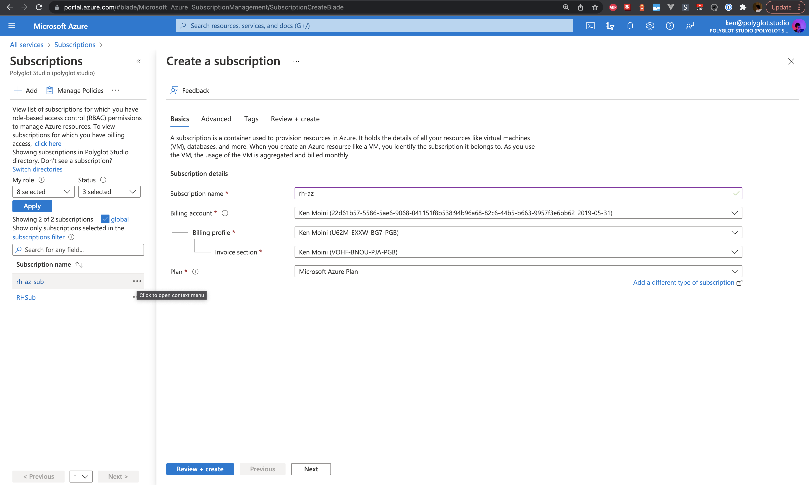
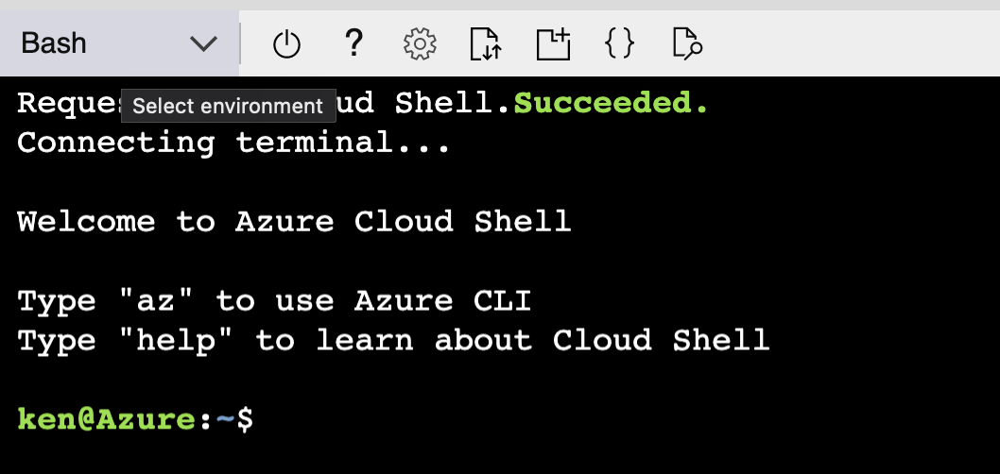

# Azure Red Hat OpenShift Deployment

> ***Note:*** Red Hat Open Environments will not work for deploying ARO manually due to not being able to create Resource Groups - this also does not work with the free Azure credits

## One-time Azure Account Setup

1. Create an Azure account: https://portal.azure.com/
2. Add a ***Payment Method*** in the **Cost Management + Billing** section of the Azure Portal.
3. Create a ***Subscription*** using that Payment Method - this may take up to 15 minutes for the Subscription to become available.  Take note of the Subscription ID.



### Initial Subscription Setup

1. Open the ***Cloud Shell*** by using the button in the top bar


2. Make sure to use a ***Bash*** shell



3. Switch to the right Subscription ID in the Cloud Shell

```bash
## Switch to the proper Azure Subscription ID
SUBSCRIPTION_ID="some-long-string"

az account set --subscription $SUBSCRIPTION_ID
```

You can use `az account list` to list all the Subscriptions available to your account if you forgot or did not take note of the Subscription ID from earlier

4. Enable the needed resource providers

```bash
## Enable the resources one by one
az provider register -n Microsoft.RedHatOpenShift --wait
az provider register -n Microsoft.Compute --wait
az provider register -n Microsoft.Storage --wait
az provider register -n Microsoft.Network --wait
az provider register -n Microsoft.Authorization --wait
az provider register -n Microsoft.ContainerRegistry --wait
az provider register -n Microsoft.Quota --wait
az provider register -n Microsoft.Subscription --wait

## Enable them all together
az provider register -n Microsoft.RedHatOpenShift --wait && \
  az provider register -n Microsoft.Compute --wait && \
  az provider register -n Microsoft.Storage --wait && \
  az provider register -n Microsoft.Network --wait && \
  az provider register -n Microsoft.Authorization --wait && \
  az provider register -n Microsoft.ContainerRegistry --wait && \
  az provider register -n Microsoft.Quota --wait && \
  az provider register -n Microsoft.Subscription --wait
```

### Azure Regions & Locations

Before begining you will need to decide which Azure Regional Location you want to deploy the ARO cluster to - list the Region Codes with the following command in the Azure Cloud Shell:

```bash
## List the available location codes
az account list-locations | jq -r '.[].name'

## Set the cluster Location
AZURE_LOCATION="eastus"
```

For most general purposes, you can likely use `eastus` or `centralus`

[Learn more about Azure Geographies](https://azure.microsoft.com/en-us/global-infrastructure/geographies/)

### Increate Quota Limits

The basic Azure quota limits are quite low, and are per Subscription - it's a quick process to increase them, [read more about it here](https://docs.microsoft.com/en-us/azure/azure-portal/supportability/per-vm-quota-requests).

There needs to be at least 40 cores available for ARO VMs and by default are of the `standardDSv3Family` and `standardDSv4Family` types unless otherwise specified during cluster creation.

You can list your current quota limits with:

```bash
az vm list-usage -l $AZURE_LOCATION \
--query "[?contains(name.value, 'standardDSv3Family')]" \
-o table
```

Make sure to increase the ***Total Regional vCPUs***, ***Standard DSv4 Family vCPUs***, and the ***Standard DSv3 Family vCPUs*** - if using other types of machines increase those family groups as well.  You can see price/size comparisons here: https://azure.microsoft.com/en-us/pricing/details/openshift/

Increasing quota limits shouldn't take more than 5-15 minutes and is located under *Subscriptions > Usage and Quotas*.

Note that some times automatic quota increases are denied and a Support Ticket is required - this can take a day so be prepared for that time requirement.

---

## Obtain a Red Hat Pull Secret

In order to have the cluster install with the Red Hat Marketplace, Operators, and Sample Workloads you will need to provide a Red Hat OpenShift Pull Secret.  This is optional but highly suggested.

Navigate to https://console.redhat.com/openshift/install/pull-secret and log in with your RHN.  Click **Copy Pull Secret** then paste into a JSON file in your Cloud Shell:

```bash
## Make sure to define the environmental variable with a surrounding SINGLE QUOTES
RH_PULL_SECRET='{"auths":{"cloud.openshift.com":{"auth":"b3Blb....superLongJSON"}}}'

## Save the Pull Secret env var to a file, surrounding with DOUBLE QUOTES
echo "$RH_PULL_SECRET" > rh-pull-secret.json
```

---

## Resource Groups

There are 1-3 possible Resource Group (RG) requirements:

- A **required** RG for the ARO cluster itself - this is a custom resource that holds the state and configuration of the ARO cluster.  This RG needs to be created beforehand and is provided with the generic `--resource-group` parameter when creating the cluster
- An **optional** VNet RG if you want to have the VNet and Subnets in a separate RG - this is provided with the `--vnet-resource-group` parameter when creating the cluster and needs to be created beforehand.
- Another **optional** Infrastructure RG that will contain the VMs, Disks, Load Balancers, and other infrastructure components of the actual ARO cluster.  This RG needs to NOT be pre-created beforehand and is provided with the `--cluster-resource-group` parameter when creating the cluster.  If this RG is not defined when the cluster is created then an RG with a randomly generated name will be made.

### Create the Resource Groups

In this example we will create a Resource Group for the ARO cluster and VNets:

```bash
## Set a Cluster Name
ARO_CLUSTER_NAME="my-aro"

## ARO Resource Group Name
RESOURCE_GROUP="${ARO_CLUSTER_NAME}-rg"
## VNet RG
VNET_RESOURCE_GROUP="vnet-${RESOURCE_GROUP}"
## Infrastructure RG - defined, not created
INFRASTRUCTURE_RESOURCE_GROUP="infra-${RESOURCE_GROUP}"

## Create the ARO Resource Group
az group create --name $RESOURCE_GROUP --location $AZURE_LOCATION

## Create the VNet Resource Group
az group create --name $VNET_RESOURCE_GROUP --location $AZURE_LOCATION
```

---

## Create a VNet & Subnets

Now that the Resource Groups are available, we can create the VNet - for customers, this may be something that is already created and can be skipped in all or some parts depending on how they have their networks managed.

```bash
## Define the VNet Name
VNET_NAME="aro-vnet"
## Define the whole VNet CIDR Network
VNET_CIDR="10.42.0.0/16"

## Create the VNet
az network vnet create \
  --resource-group $VNET_RESOURCE_GROUP \
  --name $VNET_NAME \
  --address-prefixes "${VNET_CIDR}"
```

Now that the VNet is created, we can make Subnets in that VNet's routable address space:

```bash
## Define the Subnet CIDRs and Names
VNET_CONTROL_PLANE_SUBNET_CIDR="10.42.0.0/23"
VNET_APP_NODE_SUBNET_CIDR="10.42.2.0/23"

VNET_CONTROL_PLANE_SUBNET_NAME="${ARO_CLUSTER_NAME}-cp-sn"
VNET_APP_NODE_SUBNET_NAME="${ARO_CLUSTER_NAME}-app-sn"

## Create the Control Plane Subnet
az network vnet subnet create \
  --resource-group $VNET_RESOURCE_GROUP \
  --vnet-name $VNET_NAME \
  --name $VNET_CONTROL_PLANE_SUBNET_NAME \
  --address-prefixes "${VNET_CONTROL_PLANE_SUBNET_CIDR}" \
  --service-endpoints Microsoft.ContainerRegistry

## Create the Application Node Subnet
az network vnet subnet create \
  --resource-group $VNET_RESOURCE_GROUP \
  --vnet-name $VNET_NAME \
  --name $VNET_APP_NODE_SUBNET_NAME \
  --address-prefixes "${VNET_APP_NODE_SUBNET_CIDR}" \
  --service-endpoints Microsoft.ContainerRegistry
    
## Disable subnet private endpoints
az network vnet subnet update \
  --name $VNET_CONTROL_PLANE_SUBNET_NAME \
  --resource-group $VNET_RESOURCE_GROUP \
  --vnet-name $VNET_NAME \
  --disable-private-link-service-network-policies true
```

---

## Create the ARO Cluster

There are two primary configurations that can be used to create an ARO cluster, Public or Private.

From here, it's highly suggested to observe the options provided by `az aro --help` and `az aro create --help`

### Create a Public ARO Cluster

If you want the ARO cluster to be available over the Internet then create a Public ARO cluster:

```bash
## Create the ARO Cluster and make it publicly available
az aro create \
  --name $ARO_CLUSTER_NAME \
  --resource-group $RESOURCE_GROUP \
  --cluster-resource-group $INFRASTRUCTURE_RESOURCE_GROUP \
  --vnet-resource-group $VNET_RESOURCE_GROUP \
  --vnet $VNET_NAME \
  --master-subnet $VNET_CONTROL_PLANE_SUBNET_NAME \
  --worker-subnet $VNET_APP_NODE_SUBNET_NAME \
  --apiserver-visibility Public \
  --ingress-visibility Public
```

### Create a Private ARO Cluster

If you want the ARO cluster to NOT be available over the Internet then you can create a Private ARO cluster knowing that you'll need some way to access the VNet resources such as an ExpressRoute or VPN of some sort.

```bash
## Create the Private ARO Cluster
az aro create \
  --name $ARO_CLUSTER_NAME \
  --resource-group $RESOURCE_GROUP \
  --cluster-resource-group $INFRASTRUCTURE_RESOURCE_GROUP \
  --vnet-resource-group $VNET_RESOURCE_GROUP \
  --vnet $VNET_NAME \
  --master-subnet $VNET_CONTROL_PLANE_SUBNET_NAME \
  --worker-subnet $VNET_APP_NODE_SUBNET_NAME \
  --apiserver-visibility Private \
  --ingress-visibility Private
```

### Get the ARO Cluster Details

Once the ARO cluster has been provisioned you can get the details of that cluster such as the different Credentials, IPs, and URLs with the following command:

```bash
## Get cluster details
az aro list-credentials \
  --name $ARO_CLUSTER_NAME \
  --resource-group $RESOURCE_GROUP
```

## Deleting an ARO Cluster

In case things mess up or once you are done with the ARO cluster you can delete it and all the associated resources with the following command:

```bash
## Delete the ARO Cluster and resources
az aro delete --resource-group $RESOURCE_GROUP --name $ARO_CLUSTER_NAME
```

---

# Shotgun Approach

This is the complete set of Cloud Shell commands and variables defined above - make sure to substitute your own environmental variables:

```bash
SUBSCRIPTION_ID="some-long-string" ## Switch to the proper Azure Subscription ID
AZURE_LOCATION="eastus" ## Cluster Location

## Set a Cluster Name
ARO_CLUSTER_NAME="my-aro"

RESOURCE_GROUP="${ARO_CLUSTER_NAME}-rg" ## ARO Resource Group Name
VNET_RESOURCE_GROUP="vnet-${RESOURCE_GROUP}" ## VNet RG
INFRASTRUCTURE_RESOURCE_GROUP="infra-${RESOURCE_GROUP}" # Infrastructure RG

VNET_NAME="aro-vnet" ## Define the VNet Name
VNET_CIDR="10.42.0.0/16" ## Define the whole VNet CIDR Network

## Define the Subnet CIDRs and Names
VNET_CONTROL_PLANE_SUBNET_CIDR="10.42.0.0/23"
VNET_APP_NODE_SUBNET_CIDR="10.42.2.0/23"

VNET_CONTROL_PLANE_SUBNET_NAME="${ARO_CLUSTER_NAME}-cp-sn"
VNET_APP_NODE_SUBNET_NAME="${ARO_CLUSTER_NAME}-app-sn"

####################################################################################
## Start the creation process

## Set the proper subscription context
az account set --subscription $SUBSCRIPTION_ID

## Enable the resources one by one
az provider register -n Microsoft.RedHatOpenShift --wait
az provider register -n Microsoft.Compute --wait
az provider register -n Microsoft.Storage --wait
az provider register -n Microsoft.Network --wait
az provider register -n Microsoft.Authorization --wait
az provider register -n Microsoft.ContainerRegistry --wait
az provider register -n Microsoft.Quota --wait
az provider register -n Microsoft.Subscription --wait

## Create the ARO Resource Group
az group create --name $RESOURCE_GROUP --location $AZURE_LOCATION

## Create the VNet Resource Group
az group create --name $VNET_RESOURCE_GROUP --location $AZURE_LOCATION

## Create the VNet
az network vnet create \
  --resource-group $VNET_RESOURCE_GROUP \
  --name $VNET_NAME \
  --address-prefixes "${VNET_CIDR}"

## Create the Control Plane Subnet
az network vnet subnet create \
  --resource-group $VNET_RESOURCE_GROUP \
  --vnet-name $VNET_NAME \
  --name $VNET_CONTROL_PLANE_SUBNET_NAME \
  --address-prefixes "${VNET_CONTROL_PLANE_SUBNET_CIDR}" \
  --service-endpoints Microsoft.ContainerRegistry

## Create the Application Node Subnet
az network vnet subnet create \
  --resource-group $VNET_RESOURCE_GROUP \
  --vnet-name $VNET_NAME \
  --name $VNET_APP_NODE_SUBNET_NAME \
  --address-prefixes "${VNET_APP_NODE_SUBNET_CIDR}" \
  --service-endpoints Microsoft.ContainerRegistry
    
## Disable subnet private endpoints
az network vnet subnet update \
  --name $VNET_CONTROL_PLANE_SUBNET_NAME \
  --resource-group $VNET_RESOURCE_GROUP \
  --vnet-name $VNET_NAME \
  --disable-private-link-service-network-policies true

## Create the ARO Cluster and make it publicly available
az aro create \
  --name $ARO_CLUSTER_NAME \
  --resource-group $RESOURCE_GROUP \
  --cluster-resource-group $INFRASTRUCTURE_RESOURCE_GROUP \
  --vnet-resource-group $VNET_RESOURCE_GROUP \
  --vnet $VNET_NAME \
  --master-subnet $VNET_CONTROL_PLANE_SUBNET_NAME \
  --worker-subnet $VNET_APP_NODE_SUBNET_NAME \
  --apiserver-visibility Public \
  --ingress-visibility Public
```